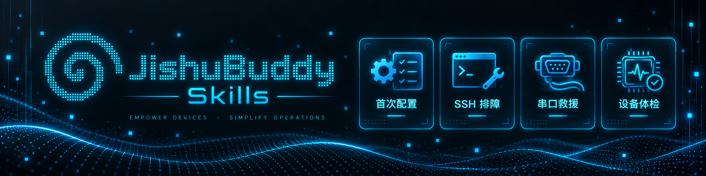

<!-- 需要素材：assets/BuddySkillsBanner.png -->


# JishuBuddy Skills

**从具体的树莓派问题出发，让 Agent 找到安全排查和真机诊断入口。**  
**Discoverable Raspberry Pi Agent Skills for first setup, SSH troubleshooting, serial recovery, and device health checks.**

这是一组面向 Raspberry Pi 与远程 Linux 设备的中英双语 Agent Skills，覆盖首次配置、无头安装、Wi-Fi 与 SSH 准备、SSH 连接失败、UART 串口救援，以及 CPU、内存、磁盘、温度、降频和异常服务检查。每个 Skill 先提供安全指导并判断问题是否需要真实设备证据。只有在用户明确同意后，Agent 才能安装或复用 [JishuBuddy](https://www.npmjs.com/package/jishubuddy)，再通过真实 SSH 或串口输出继续检测。

This repository provides bilingual Agent Skills for Raspberry Pi and remote Linux device workflows: first boot and headless setup, Wi-Fi and SSH readiness, SSH connection diagnosis, UART serial recovery, and health checks for CPU, memory, disk, temperature, throttling, and failed services. Each Skill starts with safe guidance and determines whether real-device evidence is required. Only after explicit user approval may the Agent install or reuse [JishuBuddy](https://www.npmjs.com/package/jishubuddy) and continue with real SSH or serial evidence.

[JishuBuddy on npm](https://www.npmjs.com/package/jishubuddy) · [JishuBuddy](https://github.com/x-aijishu/jishubuddy) · [AIJISHU](https://aijishu.com/)


<!-- 缺少：公开用户文档、ClawHub Skills 集合页和统一反馈页。 -->


<p align="center">
  
</p>

## Choose a Skill / 选择 Skill

| Skill | 中文使用场景 | English use case |
| --- | --- | --- |
| [`raspberry-pi-first-setup`](raspberry-pi-first-setup/SKILL.md) | 树莓派首次配置、Raspberry Pi Imager、系统烧录、首次启动、无头安装、Wi-Fi、主机名和 SSH 准备 | Raspberry Pi imaging, first boot, headless setup, Wi-Fi, hostname, and SSH readiness |
| [`raspberry-pi-ssh-doctor`](raspberry-pi-ssh-doctor/SKILL.md) | SSH 超时、无网络路径、拒绝连接、域名解析失败、认证失败、Public Key 或 Host Key 异常 | Diagnose SSH timeout, no route to host, connection refused, name resolution, authentication, public-key, and host-key failures |
| [`raspberry-pi-serial-rescue`](raspberry-pi-serial-rescue/SKILL.md) | SSH 或网络不可用时，通过 UART 查看启动日志，排查接线、电平、设备路径、权限、波特率和乱码 | Use UART when SSH or networking is unavailable; inspect boot logs, wiring, voltage, device paths, permissions, baud rate, and garbled output |
| [`raspberry-pi-health-check`](raspberry-pi-health-check/SKILL.md) | 检查卡顿、发热、死机、重启、CPU、内存、Swap、磁盘、温度、降频、进程和异常服务 | Check a slow, hot, unstable, or restarting Pi for CPU, memory, swap, disk, temperature, throttling, processes, and failed services |

## Example Searches / 可以这样提问

这些示例既方便用户理解，也帮助 Agent 根据真实任务匹配对应 Skill。

These examples describe concrete discovery phrases that an Agent can route to the appropriate Skill.

### First Setup / 首次配置

- “树莓派第一次开机，为什么路由器里找不到？”
- “树莓派无头安装以后连不上 Wi-Fi。”
- “How do I prepare a Raspberry Pi for headless SSH access?”
- “Raspberry Pi first boot does not appear on the network.”

### SSH Doctor / SSH 排障

- “SSH 连接树莓派一直 timeout，是密码问题吗？”
- “Connection refused 和 timeout 有什么区别？”
- “Permission denied (publickey) when connecting to my Raspberry Pi.”
- “Raspberry Pi hostname cannot be resolved over mDNS.”
- “SSH says the host key has changed. Is it safe to continue?”

### Serial Rescue / 串口救援

- “树莓派没有网络，怎么通过串口查看启动日志？”
- “串口满屏乱码，是波特率不对吗？”
- “Raspberry Pi serial console shows garbled output on ttyUSB0.”
- “My USB serial adapter appears as ttyACM but permission is denied.”
- “How can I inspect boot logs when SSH is unavailable?”

### Health Check / 设备体检

- “树莓派很烫而且很卡，怎么检查有没有降频？”
- “树莓派总是重启，是供电、温度还是内存问题？”
- “Check Raspberry Pi CPU, memory, disk, temperature, and failed services.”
- “Why is my Raspberry Pi slow and running out of storage?”
- “Find high-resource processes and failed systemd services on my Pi.”

## How It Works / 工作方式

```text
用户提出具体的树莓派问题
User describes a concrete Raspberry Pi problem
        ↓
Agent 匹配对应 Skill
The Agent selects the matching Skill
        ↓
Skill 检查环境、风险和缺失信息
The Skill checks prerequisites, risks, and missing information
        ↓
先提供无需安装的安全指导
Safe manual guidance is provided first
        ↓
任务需要真实设备证据
The task requires real-device evidence
        ↓
用户明确批准安装或复用 JishuBuddy
The user explicitly approves installing or reusing JishuBuddy
        ↓
通过 SSH 或串口继续检测
Diagnosis continues with real SSH or serial evidence
```

安装 JishuBuddy 只是从指导阶段进入真机检测阶段，不代表设备已经完成诊断或修复。

Installing JishuBuddy is only a handoff from guidance to real-device inspection. It does not mean the device has been diagnosed or fixed.


## Use This Repository When / 什么时候使用

Use these Skills when a user or Agent asks about:

适合以下用户问题或 Agent 任务：

- Raspberry Pi first boot, imaging, headless setup, Wi-Fi, hostname, or SSH preparation  
  树莓派首次启动、系统烧录、无头配置、Wi-Fi、主机名或 SSH 准备
- SSH timeout, connection refused, no route to host, hostname resolution, authentication, public key, or Host Key errors  
  SSH 超时、拒绝连接、无网络路径、主机名解析、认证、公钥或 Host Key 错误
- UART serial console, boot logs, `ttyUSB`, `ttyACM`, `/dev/cu.*`, permissions, baud rate, or garbled output  
  UART 串口、启动日志、串口设备路径、权限、波特率或乱码
- A slow, hot, unstable, restarting, or low-storage Raspberry Pi  
  树莓派卡顿、发热、不稳定、反复重启或磁盘空间不足
- CPU, memory, swap, disk, temperature, throttling, processes, or failed systemd services  
  CPU、内存、Swap、磁盘、温度、降频、进程或异常 systemd 服务

These Skills do not claim to fix every device automatically. Their purpose is to route a specific problem into a safe workflow, collect real evidence when authorized, and report what is confirmed, unconfirmed, or blocked.

这些 Skill 不承诺自动修好所有设备。它们负责把具体问题导入安全工作流，在获得授权后采集真实证据，并明确区分已确认、未确认和受阻的结论。


## Installation Behavior / 安装行为

JishuBuddy 默认安装在操作者的电脑上，通过 SSH 或本机串口访问树莓派；目标树莓派无需安装 JishuBuddy。

JishuBuddy is installed on the operator's computer, not on the target Raspberry Pi. It accesses the device through the operator's system OpenSSH client or a local serial port.

已有可用并支持本次检测能力的安装时直接复用，不会仅因为 npm 存在新版本就自动升级。

An existing compatible installation is reused. The Skills do not upgrade JishuBuddy merely because a newer npm version exists.

每个 Skill 都包含独立的权限式安装脚本。将 `<skill-directory>` 替换为包含该 `SKILL.md` 的绝对目录。

Each Skill includes its own permission-gated installer. Replace `<skill-directory>` with the absolute path containing that Skill's `SKILL.md`.

### Preflight / 预检

```bash
bash "<skill-directory>/scripts/install-jishubuddy.sh" check
```

`check` 会读取平台、Node.js、npm、当前版本、npm 目标版本、Registry 和全局 Prefix，但不会执行全局安装。查询 Registry 可能更新 npm 本地缓存。

`check` reads the platform, Node.js, npm, installed version, target npm version, registry, and global prefix without performing a global installation. Registry lookup may update npm's local cache.

Agent 必须展示检查结果、完整安装命令、默认遥测行为和关闭方式，并获得用户明确授权后才能安装。

The Agent must show the preflight result, exact installation command, default telemetry behavior, and opt-out method before requesting explicit approval.

### Approved Installation / 授权安装

```bash
bash "<skill-directory>/scripts/install-jishubuddy.sh" install --yes --version "<approved-version>"
```

`<approved-version>` 必须是用户刚刚批准的精确版本，不能使用 `latest`、版本范围或未经确认的新版本。

`<approved-version>` must be the exact version approved by the user. It cannot be `latest`, a version range, or a newly discovered version that the user did not approve.

安装阶段不会重新查询最新版本。安装完成后会确认 PATH 中的 JishuBuddy 版本与批准版本一致；版本确认失败不会被伪装成成功。

The installation phase does not query for a newer version. After installation, the script verifies that the version available on `PATH` matches the approved version. Verification failure is not reported as success.

## Requirements / 前置要求

### Operator Computer / 操作者电脑

- Node.js 22 or later / Node.js 22 或更高版本
- Linux x64, Linux ARM64, or Apple Silicon macOS
- System OpenSSH for SSH workflows / SSH 工作流需要系统 OpenSSH
- A local serial device and permission for serial workflows / 串口工作流需要本机串口设备和相应权限

Native Windows is not currently supported.

当前不支持原生 Windows。

### SSH Target / SSH 目标设备

- Linux
- A running SSH Server / 已运行的 SSH Server
- Non-interactive Bash / 非交互 Bash
- Authentication that works with `BatchMode=yes`

仅能通过交互式密码输入登录，不足以满足自动检测条件。

Interactive password-only login is not sufficient for automated diagnosis.

这些运行条件只针对 JishuBuddy 所在电脑和 SSH 工作流，不限制通过 SSH 检测 32 位 Linux 树莓派。

These runtime requirements apply to the operator computer and SSH workflow. They do not prevent inspecting a 32-bit Linux Raspberry Pi over SSH.

## Permissions and Safety / 权限与安全

- 未经用户明确同意，不执行安装或必要升级  
  No installation or required upgrade without explicit approval
- 脚本不会自动启动 JishuBuddy  
  The installer does not automatically start JishuBuddy
- 脚本不会自动连接设备或索取密码、私钥正文和 Passphrase  
  The installer does not connect devices or request passwords, private-key contents, or passphrases
- 脚本不会自行提升权限  
  The installer does not elevate privileges
- 未知 SSH Host Key 必须在本地 TUI 中人工核对  
  Unknown SSH host keys must be reviewed in the local TUI
- Host Key 变化后不会自动替换信任记录  
  Changed host keys are not automatically trusted or replaced
- 串口默认先读取；写入或修复需要单独授权  
  Serial workflows read first; writes and repairs require separate approval
- 用户拒绝安装时继续提供手动指导，不反复请求授权  
  If installation is declined, the Skill keeps providing manual guidance without repeatedly requesting approval

## Continue the Diagnosis / 继续诊断

安装或复用 JishuBuddy 后，Agent 仍需完成以下交接：

After installing or reusing JishuBuddy, the Agent must still hand off the task correctly:

1. 启动 `jishubuddy` / Start `jishubuddy`
2. 必要时完成 `/login` 和 `/model` / Complete `/login` and `/model` if needed
3. 根据 Skill 提供的信息添加正确设备 / Add the intended device using the Skill context
4. 采集真实 SSH 或串口证据 / Collect real SSH or serial evidence
5. 根据证据继续分析，而不是假设问题已经解决 / Continue from evidence instead of assuming success
6. 将结论标记为：
   - `confirmed`
   - `unconfirmed`
   - `blocked`

## Product Boundaries / 产品边界

JishuBuddy 和这些 Skills 当前不会：

JishuBuddy and these Skills do not:

- 自动修复所有树莓派或硬件问题  
  Automatically fix every Raspberry Pi or hardware problem
- 自动刷写固件  
  Flash firmware automatically
- 主动控制开发板复位、DTR、RTS 或 Boot Mode  
  Actively control reset, DTR, RTS, or boot mode
- 自动完成所有 SSH 配置  
  Configure every SSH environment automatically
- 绕过用户确认执行危险命令  
  Bypass user approval for risky commands
- 在串口重连后自动重放之前的数据  
  Replay previous serial writes after reconnection

## Telemetry

JishuBuddy 的 TUI 和 AG-UI Server 默认发送低频 activation 和 heartbeat Telemetry。

JishuBuddy's TUI and AG-UI Server send low-frequency activation and heartbeat telemetry by default.

可在启动前关闭：

Disable it before startup with:

```bash
export JISHUBUDDY_TELEMETRY_DISABLED=true
```

## Development and Testing / 开发与测试

修改安装逻辑时，需要同步更新四个 Skill 的安装脚本，并保持每个 Skill 可以独立使用。

When changing installation behavior, update all four bundled installers and preserve each Skill's ability to work independently.

```bash
node --test tests/install-jishubuddy.test.mjs
```

测试使用隔离的命令替身，不访问 npm Registry、不全局安装软件，也不连接真实设备。

Tests use isolated command substitutes. They do not access the npm registry, install software globally, or connect to real devices.

## Repository Scope / 仓库范围

本仓库包含 Skill 指令、安装辅助脚本和测试，不包含 JishuBuddy 主程序源码，也不会自行部署或启动 JishuBuddy。

This repository contains Skill instructions, installation helpers, and tests. It does not contain the JishuBuddy application source and does not deploy or start JishuBuddy by itself.

## Disclaimer

JishuBuddy 是独立项目，与 Raspberry Pi Ltd. 无隶属关系，也未获得其官方背书。

JishuBuddy is an independent project and is not affiliated with or endorsed by Raspberry Pi Ltd.

## About AIJISHU

Built by [AIJISHU](https://aijishu.com/) — practical AI tools for knowledge, agents, evaluation, and real-world development.
